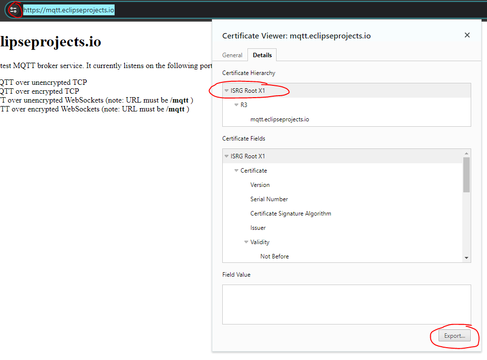

# PsychicMqttClient

Fully featured async MQTT 3.1.1 client for ESP32 with support for SSL/TLS and MQTT over WS. Uses the ESP-IDF MQTT client library under the hood and adds a powerful but easy to use API on top of it. Supports MQTT over TCP, SSL with mbedtls, MQTT over Websocket and MQTT over Websocket Secure.

There are countless popular MQTT client libraries available for Arduino and ESP32. Like [AsyncMqttClient](https://github.com/marvinroger/async-mqtt-client) by Marvin Roger, [pubsubclient](https://github.com/knolleary/pubsubclient) by knolleary and [arduino-mqtt](https://github.com/256dpi/arduino-mqtt) by 256dpi. They are widely used, but all have their unique limitations. Like not supporting all QoS levels, limited message size and none of them has a practical support for SSL/TLS. Also MQTT over websocket is missing in all of them.

The API is very similar to [AsyncMqttClient](https://github.com/marvinroger/async-mqtt-client) for the ESP32 by Marvin Roger, so that this library can be used almost as a drop-in replacement. Only minor adjustments are necessary.

## Features

- Supports MQTT 3.1.1 with QoS 0, QoS 1 and QoS 2
- Compatible with all ESP32 variants (ESP32, ESP32-S2, ESP32-S3, ESP32-C3, ESP32-C6, ...)
- Supports MQTT over TCP and MQTT over websocket
- Full support for SSL/TSL encryption - for both MQTT over TCP and MQTT over WS
- No limitation in buffer size for transmit and receive messages. Multipart messages are reassembled.
- Fully asynchronous and non-blocking
- No dependencies to other libraries
- Flexible and powerful event-based API
  - `onTopic()` event which calls a callback every time a message on a specific subscribed topic is received
- Handles reconnects automatically
- Automatically embeds a X509 Root CA Bundle into the binary on platformio

## Usage

MQTT has never been easier to use. Instantiate the MQTT client, set the server URI, and subscribe to a topic with the `onTopic()` event handler. Easy to use with a lambda function where you can work with the received payload. Connect the MQTT client to the server and you're set. Publish works as expected from any other MQTT client.

```cpp
#include <PsychicMqttClient.h>

PsychicMqttClient mqttClient;

void setup()
{
  // Setup Serial, WiFi, ...

  mqttClient.setServer("mqtt://mqtt.eclipseprojects.io");

  mqttClient.onTopic("your/topic", 0, [&](const char *topic, const char *payload, int retain, int qos, bool dup)
                       {
                        Serial.printf("Received Topic: %s\r\n", topic);
                        Serial.printf("Received Payload: %s\r\n", payload); });

  mqttClient.connect();
}

void loop()
{
  // Your logic
  mqttClient.publish("your/topic", 0, 0, "Hello World!");
}
```

The client will handle all the connection details on its own. It will attempt to reconnect automatically, so you don't need to take care of this.

> [!IMPORTANT]
> No blocking code inside event handler functions. These must return fast. Especially no `delay()`, hardware functions or any other blocking code. Store the results and notify your main loop to take actions. If applicable use FreeRTOS toolings like queues or semaphores to protect against race conditions.

## SSL/TLS Encryption

Using SSL/TLS encryption can be a little bit tedious, but with this MQTT client this is exceptionally easy. You can include a single PEM certificate in the code, or create a bundle of certificates with a platformio script. These are embedded into the binary and offer you universal SSL/TLS support for a wide range of servers without headaches.

### Single CA Root Certificate

If you only need to connect to one specific MQTT server, which will never change, directly embedding the certificate into the source file is the easiest method.

You can get the root certificate directly from the browser. Open the domain of your MQTT server and verify the SSL encryption by pressing on the icon left to the URL. On Chrome press on `Connection is Secure` > `Certificate is Valid` to open the certificate dialog. (Works similar on all other browsers.)



In the Certificate Viewer select the Root Certificate at the top of the tree and press `Export` or any other way to download it. Open the downloaded file and copy the content into your source file. Format the string that it looks like shown below. Add the quotes and `\n` line breaks to keep the block format.

```cpp
const char *eclipse_root_ca = "-----BEGIN CERTIFICATE-----\n"
                              "MIIFazCCA1OgAwIBAgIRAIIQz7DSQONZRGPgu2OCiwAwDQYJKoZIhvcNAQELBQAw\n"
                              "TzELMAkGA1UEBhMCVVMxKTAnBgNVBAoTIEludGVybmV0IFNlY3VyaXR5IFJlc2Vh\n"
                              "cmNoIEdyb3VwMRUwEwYDVQQDEwxJU1JHIFJvb3QgWDEwHhcNMTUwNjA0MTEwNDM4\n"
                              "WhcNMzUwNjA0MTEwNDM4WjBPMQswCQYDVQQGEwJVUzEpMCcGA1UEChMgSW50ZXJu\n"
                              "ZXQgU2VjdXJpdHkgUmVzZWFyY2ggR3JvdXAxFTATBgNVBAMTDElTUkcgUm9vdCBY\n"
                              "MTCCAiIwDQYJKoZIhvcNAQEBBQADggIPADCCAgoCggIBAK3oJHP0FDfzm54rVygc\n"
                              "h77ct984kIxuPOZXoHj3dcKi/vVqbvYATyjb3miGbESTtrFj/RQSa78f0uoxmyF+\n"
                              "0TM8ukj13Xnfs7j/EvEhmkvBioZxaUpmZmyPfjxwv60pIgbz5MDmgK7iS4+3mX6U\n"
                              "A5/TR5d8mUgjU+g4rk8Kb4Mu0UlXjIB0ttov0DiNewNwIRt18jA8+o+u3dpjq+sW\n"
                              "T8KOEUt+zwvo/7V3LvSye0rgTBIlDHCNAymg4VMk7BPZ7hm/ELNKjD+Jo2FR3qyH\n"
                              "B5T0Y3HsLuJvW5iB4YlcNHlsdu87kGJ55tukmi8mxdAQ4Q7e2RCOFvu396j3x+UC\n"
                              "B5iPNgiV5+I3lg02dZ77DnKxHZu8A/lJBdiB3QW0KtZB6awBdpUKD9jf1b0SHzUv\n"
                              "KBds0pjBqAlkd25HN7rOrFleaJ1/ctaJxQZBKT5ZPt0m9STJEadao0xAH0ahmbWn\n"
                              "OlFuhjuefXKnEgV4We0+UXgVCwOPjdAvBbI+e0ocS3MFEvzG6uBQE3xDk3SzynTn\n"
                              "jh8BCNAw1FtxNrQHusEwMFxIt4I7mKZ9YIqioymCzLq9gwQbooMDQaHWBfEbwrbw\n"
                              "qHyGO0aoSCqI3Haadr8faqU9GY/rOPNk3sgrDQoo//fb4hVC1CLQJ13hef4Y53CI\n"
                              "rU7m2Ys6xt0nUW7/vGT1M0NPAgMBAAGjQjBAMA4GA1UdDwEB/wQEAwIBBjAPBgNV\n"
                              "HRMBAf8EBTADAQH/MB0GA1UdDgQWBBR5tFnme7bl5AFzgAiIyBpY9umbbjANBgkq\n"
                              "hkiG9w0BAQsFAAOCAgEAVR9YqbyyqFDQDLHYGmkgJykIrGF1XIpu+ILlaS/V9lZL\n"
                              "ubhzEFnTIZd+50xx+7LSYK05qAvqFyFWhfFQDlnrzuBZ6brJFe+GnY+EgPbk6ZGQ\n"
                              "3BebYhtF8GaV0nxvwuo77x/Py9auJ/GpsMiu/X1+mvoiBOv/2X/qkSsisRcOj/KK\n"
                              "NFtY2PwByVS5uCbMiogziUwthDyC3+6WVwW6LLv3xLfHTjuCvjHIInNzktHCgKQ5\n"
                              "ORAzI4JMPJ+GslWYHb4phowim57iaztXOoJwTdwJx4nLCgdNbOhdjsnvzqvHu7Ur\n"
                              "TkXWStAmzOVyyghqpZXjFaH3pO3JLF+l+/+sKAIuvtd7u+Nxe5AW0wdeRlN8NwdC\n"
                              "jNPElpzVmbUq4JUagEiuTDkHzsxHpFKVK7q4+63SM1N95R1NbdWhscdCb+ZAJzVc\n"
                              "oyi3B43njTOQ5yOf+1CceWxG1bQVs5ZufpsMljq4Ui0/1lvh+wjChP4kqKOJ2qxq\n"
                              "4RgqsahDYVvTH9w7jXbyLeiNdd8XM2w9U/t7y0Ff/9yi0GE44Za4rF2LN9d11TPA\n"
                              "mRGunUHBcnWEvgJBQl9nJEiU0Zsnvgc/ubhPgXRR4Xq37Z0j4r7g1SgEEzwxA57d\n"
                              "emyPxgcYxn/eR44/KJ4EBs+lVDR3veyJm+kXQ99b21/+jh5Xos1AnX5iItreGCc=\n"
                              "-----END CERTIFICATE-----\n";
```

When setting the server URI just add the reference to the root CA certificate:

```cpp
mqttClient.setCACert(eclipse_root_ca);
```

That's it. Your MQTT connection is encrypted now.

### X509 CA Root Certificate Bundles

If you require universal connectivity to more then one server with different root certificate authorities you can use the python script in the `/scripts` folder. It will either download a standard set of the most popular root CA's or use a set of certificates in \*.PEM or \*.DEM file format located in the folder `/ssl_certs`. For the download either the Mozilla collection at [https://curl.se/ca/cacert.pem](https://curl.se/ca/cacert.pem) is used or a collection curated by [Adafruit](https://github.com/adafruit/certificates/) specifically adjusted for the constraints of embedded systems.

Copy the script from the library folder into your platformio project folder `./scripts` so that it can be found. In the `platformio.ini` add the following lines

```ini
extra_scripts = pre:scripts/generate_cert_bundle.py
; Source for SSL Cert Store can bei either downloaded from Mozilla with 'mozilla' ('https://curl.se/ca/cacert.pem')
; or from a curated Adafruit repository with 'adafruit' (https://raw.githubusercontent.com/adafruit/certificates/main/data/roots.pem)
; or complied from a 'folder' full of *.pem / *.dem files stored in the ./ssl_certs folder
board_ssl_cert_source = adafruit
board_build.embed_files = src/certs/x509_crt_bundle.bin
```

and configure `board_ssl_cert_source` to your needs. If you use your own collection copy the \*.PEM / \*.DEM certificate files to `./ssl_certs`. The platformio build system will automatically compile the certificates into a binary file and embed them into the final binary. This can be later accessed in your code by

```cpp
extern const uint8_t rootca_crt_bundle_start[] asm("_binary_src_certs_x509_crt_bundle_bin_start");
extern const uint8_t rootca_crt_bundle_end[] asm("_binary_src_certs_x509_crt_bundle_bin_end");
```

To include the bundle for the MQTT client simply call

```cpp
mqttClient.setCACertBundle(rootca_crt_bundle_start);
```

when configuring the MQTT client instance before connecting.

#### Together with WiFiClientSecure

If you use WiFiClientSecure in your application, it can be configured to use the X509 certificate bundle as well. In that case you should use WiFiClientSecure to instantiate the certificate bundle before calling `attachArduinoCACertBundle()`.

```cpp
WiFiClientSecure client;
client.setCACertBundle(rootca_crt_bundle_start);
// ...
mqttClient.attachArduinoCACertBundle();
```

Otherwise the bundle will be overwritten by the MQTT client with unwanted side effects.

> [!IMPORTANT]  
> Currently there is a bug in mbedtls which prevents the proper certificate validation for all certificates signed by `Let's encrypt`. For this reason working directly with the ISRG Root X1 CA certificate or the bundle downloaded from Mozilla might result in SSL failing. You need to include the DST Root CA X3 certificate as well. Cirrently this is only done by the Adafruit repository. You can [read](https://github.com/adafruit/certificates/pull/1) here and [here](https://github.com/espressif/arduino-esp32/issues/8626) about the details.

## Advanced Usage

Check the commented header file and the `FullyFeatured` example for a complete list of all event handlers and configuration options. You can even get access to the ESP-IDF MQTT Clients' configuration object, should you need parameters not broken out to the API.

## License

MIT License

Copyright (c) 2024 elims

Permission is hereby granted, free of charge, to any person obtaining a copy
of this software and associated documentation files (the "Software"), to deal
in the Software without restriction, including without limitation the rights
to use, copy, modify, merge, publish, distribute, sublicense, and/or sell
copies of the Software, and to permit persons to whom the Software is
furnished to do so, subject to the following conditions:

The above copyright notice and this permission notice shall be included in all
copies or substantial portions of the Software.

THE SOFTWARE IS PROVIDED "AS IS", WITHOUT WARRANTY OF ANY KIND, EXPRESS OR
IMPLIED, INCLUDING BUT NOT LIMITED TO THE WARRANTIES OF MERCHANTABILITY,
FITNESS FOR A PARTICULAR PURPOSE AND NONINFRINGEMENT. IN NO EVENT SHALL THE
AUTHORS OR COPYRIGHT HOLDERS BE LIABLE FOR ANY CLAIM, DAMAGES OR OTHER
LIABILITY, WHETHER IN AN ACTION OF CONTRACT, TORT OR OTHERWISE, ARISING FROM,
OUT OF OR IN CONNECTION WITH THE SOFTWARE OR THE USE OR OTHER DEALINGS IN THE
SOFTWARE.
